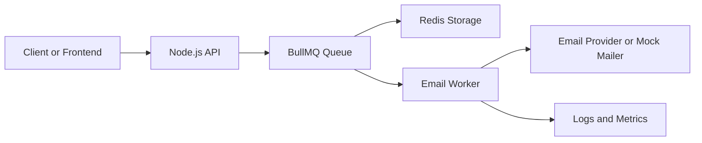
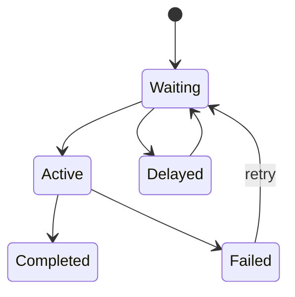

# Beginner to Advanced Course: Building an Email Queue System

## 1. Big Picture

### What is a queue?

A queue is a data structure and system pattern where items are added at one side and processed in order, usually first in, first out.

The item placed into the queue is often called a `job` or `message`.

Real-world analogy:

- A customer takes a token at a bank counter.
- Tokens wait in line.
- A staff member calls the next token.
- Work happens when the token reaches the front.

In software:

- the producer adds work
- the queue stores pending work
- the worker or consumer processes the work

### Why do we use queues?

Queues help when work should not block the user request.

Example:

- A user signs up on a website.
- The website must send a welcome email.
- Sending the email directly during the request can be slow or fail temporarily.
- Instead, the app pushes an email job into a queue and responds quickly.
- A worker sends the email in the background.

Benefits:

- faster API responses
- better reliability
- retries for temporary failures
- controlled concurrency
- easier scaling
- separation between request handling and background work

### When should you not use a queue?

Do not use a queue for everything.

Queues add:

- operational complexity
- Redis infrastructure
- worker processes
- failure handling logic
- monitoring requirements

Use a queue when work is:

- slow
- retryable
- asynchronous
- high volume
- independent from the immediate HTTP response

## 2. Core Concepts

### FIFO

FIFO means first in, first out.

If job A enters before job B, job A is usually processed first.

Some queue systems also support:

- priority jobs
- delayed jobs
- scheduled jobs
- parallel processing

### Producer

The producer creates jobs and puts them into the queue.

In our project:

- the API server will be the producer

### Worker or Consumer

The worker pulls jobs from the queue and processes them.

In our project:

- the worker will send emails

### Job States

Most queue systems track job states such as:

- waiting
- active
- completed
- failed
- delayed

### Retry

If a job fails because of a temporary issue, the queue can try again.

Example temporary issues:

- mail service timeout
- Redis connection interruption
- rate limiting by an external provider

### Backoff

Backoff means waiting some time before retrying.

Example:

- first retry after 5 seconds
- second retry after 15 seconds
- third retry after 30 seconds

This avoids hammering a failing dependency.

## 3. How Our System Will Work



### Request flow

1. A client sends a request to the API to send an email.
2. The API validates the request.
3. The API adds a job to the BullMQ queue.
4. Redis stores the job data.
5. A worker picks up the job.
6. The worker tries to send the email.
7. The job becomes completed or failed.
8. If it fails and retries are configured, BullMQ retries it.

## 4. Technology Choices

### Node.js

We use Node.js because BullMQ runs well in JavaScript and TypeScript backends.

### TypeScript

We use TypeScript to make the code safer and easier to understand as the project grows.

### Redis

Redis is an in-memory data store. BullMQ uses Redis to store queue data, job state, delays, locks, and scheduling details.

Important beginner idea:

- BullMQ is the queue library
- Redis is the storage and coordination layer behind it

### BullMQ

BullMQ is a Node.js library for building reliable job queues on top of Redis.

It provides:

- queues
- workers
- events
- retries
- backoff
- delayed jobs
- concurrency controls

## 5. What You Will Learn, Module by Module

## Module 1: Queue Foundations

### Goal

Understand what a queue is before touching libraries.

### Learn

- queue vs stack
- FIFO
- producer and consumer
- sync vs async work
- why email sending is a good queue use case

### Output

- concept notes
- glossary
- architecture sketch

### Suggested commit

`docs: add queue fundamentals and system overview`

## Module 2: Local Environment Setup

### Goal

Prepare a clean Node.js and TypeScript project.

### Learn

- what each project file is for
- how TypeScript compiles
- how Node runs the code
- how to organize source folders

### Terminal steps

```powershell
mkdir src,docs
npm init -y
npm install bullmq ioredis express dotenv
npm install -D typescript ts-node-dev @types/node @types/express
npx tsc --init
```

### Output

- `package.json`
- `tsconfig.json`
- initial folder structure

### Suggested commit

`chore: initialize Node.js and TypeScript project`

## Module 3: Redis and BullMQ First Contact

### Goal

Understand how BullMQ talks to Redis.

### Learn

- Redis role in queue systems
- queue connection setup
- creating a queue object
- adding the first test job

### Output

- shared Redis connection config
- first BullMQ queue
- first sample job

### Suggested commit

`feat: create Redis connection and email queue`

## Module 4: First Worker

### Goal

Process jobs from the queue.

### Learn

- what a worker process does
- how job data is received
- how completion and failure work
- difference between producer code and worker code

### Output

- worker file
- mock email sender
- console logs for job lifecycle

### Suggested commit

`feat: add basic email worker`

## Module 5: Email Job Payload Design

### Goal

Design strong TypeScript types for email jobs.

### Learn

- what fields a job should contain
- type safety for queue jobs
- validation thinking
- future-proofing payloads

### Example payload

```ts
type EmailJobData = {
  to: string;
  subject: string;
  html: string;
  requestId?: string;
};
```

### Suggested commit

`feat: define typed email job contract`

## Module 6: API Producer

### Goal

Build an HTTP endpoint that adds email jobs to the queue.

### Learn

- Express route basics
- request validation
- queueing instead of direct processing
- returning a job id to the client

### Output

- `POST /emails`
- job creation response

### Suggested commit

`feat: add email enqueue API endpoint`

## Module 7: Retries and Backoff

### Goal

Handle temporary failure correctly.

### Learn

- difference between transient and permanent failures
- retry attempts
- fixed backoff vs exponential backoff
- when retries can be dangerous

### Output

- retry configuration
- backoff strategy
- failure simulation

### Suggested commit

`feat: add retry and backoff behavior`

## Module 8: Delayed Jobs

### Goal

Schedule emails for later.

### Learn

- delayed jobs
- scheduled sends
- how Redis stores delayed work

### Output

- endpoint or script to schedule an email later

### Suggested commit

`feat: support delayed email jobs`

## Module 9: Priority and Concurrency

### Goal

Control how work is processed under load.

### Learn

- job priority
- concurrency in workers
- how too much concurrency can overload dependencies
- balancing throughput and safety

### Suggested commit

`feat: configure job priority and worker concurrency`

## Module 10: Events and Monitoring

### Goal

Observe the queue system.

### Learn

- completed and failed events
- logging lifecycle events
- why visibility matters in production

### Output

- queue event listeners
- basic metrics and logs

### Suggested commit

`feat: add queue event monitoring`

## Module 11: Idempotency and Duplicate Prevention

### Goal

Avoid sending duplicate emails by mistake.

### Learn

- what idempotency means
- duplicate job risks
- using stable job ids or request ids

### Suggested commit

`feat: add idempotency controls for email jobs`

## Module 12: Graceful Shutdown

### Goal

Stop the system safely.

### Learn

- why workers must shut down carefully
- draining in-flight jobs
- handling process signals

### Suggested commit

`feat: implement graceful shutdown for API and workers`

## Module 13: Real Email Provider Integration

### Goal

Replace the mock sender with a real provider later.

### Learn

- provider abstraction
- separating queue logic from transport logic
- environment-based configuration

### Suggested commit

`feat: add pluggable email provider integration`

## Module 14: Production Readiness

### Goal

Reason like a backend engineer operating real systems.

### Learn

- dead-letter thinking
- poison jobs
- monitoring alerts
- queue depth
- retry storms
- horizontal scaling
- Redis reliability

### Suggested commit

`docs: add production operations guide`

## Module 15: Advanced Topics

### Goal

Understand how industry systems grow beyond the basics.

### Learn

- multiple queues
- dedicated workers by job type
- rate limiting by tenant
- outbox pattern
- exactly-once vs at-least-once thinking
- batching

### Suggested commit

`docs: add advanced queue patterns`

## 6. Project Structure We Will Build Toward

```text
src/
  config/
    env.ts
    redis.ts
  queues/
    emailQueue.ts
  jobs/
    emailJob.ts
  workers/
    emailWorker.ts
  services/
    mailer.ts
  routes/
    emailRoutes.ts
  app.ts
  server.ts
docs/
  course.md
```

## 7. Beginner Mental Model

Think of the system as two separate responsibilities:

### API responsibility

- accept request
- validate data
- add job to queue
- respond quickly

### Worker responsibility

- read queued jobs
- do the slow work
- retry on temporary failure
- report success or failure

This separation is one of the most important backend design ideas in this course.

## 8. Queue Lifecycle Diagram



## 9. Industry Thinking You Should Start Learning Early

Even as a beginner, learn to ask these questions:

- What happens if Redis is down?
- What happens if the worker crashes mid-job?
- Can the same email be sent twice?
- How many jobs can the worker process safely at once?
- How do we inspect failed jobs?
- How do we stop the system safely during deployment?

These questions separate tutorial code from real system design.

## 10. Recommended Git Workflow for This Course

Use one meaningful commit per learning milestone.

Suggested order:

1. `docs: add queue fundamentals and system overview`
2. `chore: initialize Node.js and TypeScript project`
3. `feat: create Redis connection and email queue`
4. `feat: add basic email worker`
5. `feat: define typed email job contract`
6. `feat: add email enqueue API endpoint`
7. `feat: add retry and backoff behavior`
8. `feat: support delayed email jobs`
9. `feat: configure job priority and worker concurrency`
10. `feat: add queue event monitoring`
11. `feat: add idempotency controls for email jobs`
12. `feat: implement graceful shutdown for API and workers`
13. `feat: add pluggable email provider integration`
14. `docs: add production operations guide`
15. `docs: add advanced queue patterns`

## 11. How We Will Learn Step by Step

At each step, we will follow this teaching pattern:

1. explain the concept in plain language
2. connect it to the email system
3. write only the code needed for that step
4. run it from the terminal
5. verify behavior
6. commit the milestone

## 12. What Success Looks Like at the End

By the end, you should be able to explain:

- why queues exist
- how Redis and BullMQ work together
- how producers and workers communicate indirectly
- why retries need careful design
- how to structure a background job system
- what makes a queue system production-ready

You should also be able to build and run:

- a local Redis-backed queue
- an API that enqueues email jobs
- a worker that processes them
- a system that handles failures more safely than direct synchronous code

## 13. Where We Start Next

The first hands-on coding step should be:

### Step 1

Set up the Node.js and TypeScript project, create the folder structure, and write a tiny TypeScript file that demonstrates the producer and worker idea without BullMQ yet.

Reason:

Before using BullMQ, you should first understand the architecture in simple terms. Then the library will feel easier instead of magical.
